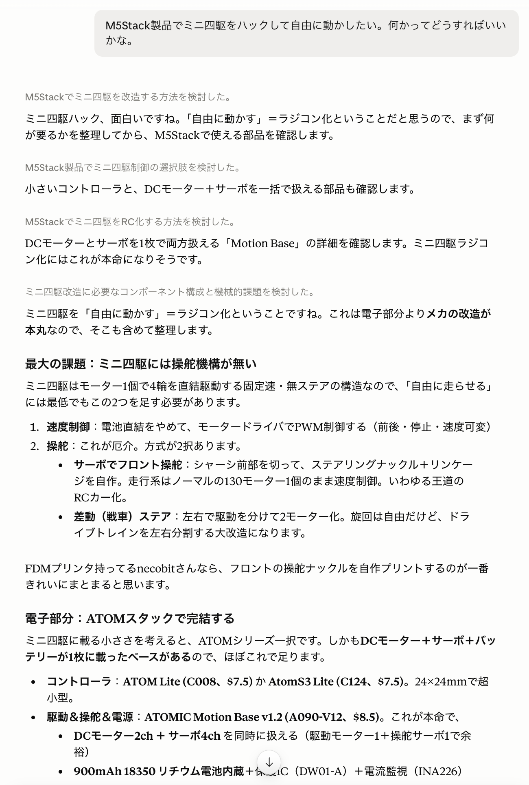

# M5Stack MCP Server

M5Stack製品の選定を支援するMCP (Model Context Protocol) サーバー。
現行650製品超のラインナップ（Core / Stick / Atom / Stamp / Unit / Module / Hat / Base …）を横断して、検索・互換性チェック・用途に応じた構成提案・価格在庫確認ができます。

## 特徴

- **オフライン高速動作** — 正規化済みの製品スナップショット（shop.m5stack.com + 公式docsの2ソース統合）を同梱
- **互換性判定** — フォームファクタ規約 + 手動キュレーションルールの3層エンジン。判定には必ず根拠（basis）と確度（confidence）が付く
- **構成提案** — 用途の自由記述から役割別の候補製品・互換性マトリクス・最安バンドルを構造化データで返し、最終判断はLLMに委ねる設計
- **ライブ価格・在庫** — 必要なときだけ shop.m5stack.com から現在値を取得（キャッシュ付き）

## セットアップ

```bash
npm install
npm run build
```

### Claude Code に登録

```bash
claude mcp add m5stack -- node /path/to/M5Stack-MCP/dist/index.js
```

### Claude Desktop に登録

`claude_desktop_config.json` に追加:

```json
{
  "mcpServers": {
    "m5stack": {
      "command": "node",
      "args": ["/path/to/M5Stack-MCP/dist/index.js"]
    }
  }
}
```

## ツール一覧

| ツール | 用途 |
|--------|------|
| `search_products` | キーワード・カテゴリ・タグ・価格での製品検索 |
| `get_product` | handle/SKUによる製品詳細（スペック、Groveポート、docsリンク） |
| `list_categories` | カテゴリ体系と製品数の一覧 |
| `check_compatibility` | コントローラ×周辺機器の互換性判定（根拠・確度付き） |
| `suggest_configuration` | 用途記述→役割別候補+互換マトリクス+最安バンドル |
| `get_price_stock` | 現在価格・在庫のライブ取得（最大10件） |
| `update_catalog` | 製品カタログをその場で再取得（新製品対応、結果はローカルキャッシュに保存） |

## 使用例（Claude への質問例）

- 「温湿度を測ってWi-Fiでサーバーに送る最小構成は？」
- 「ENV IV Unit は AtomS3 Lite で使える？」
- 「CoreS3 と Core2 どちらを選ぶべき？在庫ある？」
- 「予算50ドルで土壌水分監視のプロトタイプを組みたい」

実際の応答例（「ミニ四駆をハックして自由に動かしたい」と相談したところ）:



## データ更新

M5Stackは新製品のリリースが頻繁なため、複数の経路で追従します。**基本的に何もしなくてもインストール済みの各環境が自動で最新に追従します。**

1. **起動時の自動更新（各ローカル）** — サーバー起動時にスナップショットが7日以上古いと、バックグラウンドで公式ソースから再取得し `~/.cache/m5stack-mcp/` に保存します。以降の起動は同梱データより新しいキャッシュを優先します。無効化は環境変数 `M5STACK_MCP_AUTO_UPDATE=0`
2. **`update_catalog` ツール** — 「新製品が見つからない」「最新のラインナップで調べて」といった場面でClaude自身がその場で再取得できます（約15〜30秒）
3. **リポジトリの週次自動更新（GitHub Actions）** — 毎週月曜にデータを再取得し、差分があれば自動コミット（[.github/workflows/update-data.yml](.github/workflows/update-data.yml)、手動実行も可）。クローンしたての状態でも比較的新しいデータが手に入ります
4. **手動**: `npm run update-data`（リポジトリ同梱の `data/` を再生成）

ツール応答には常に `data_as_of`（スナップショット取得日時）が含まれ、45日以上古い場合は `update_catalog` を促す警告が付きます。新製品は互換性キュレーションが無くても、フォームファクタ規則＋本文からの自動抽出で判定されます（confidenceが下がるだけで動作します）。

- ソース: `shop.m5stack.com` の Shopify JSON（全製品・価格・在庫・EOL）+ [m5-docs](https://github.com/m5stack/m5-docs) の `product_list.json`（docsリンク・キーワード）
- 差分レポート（新規/削除/EOL遷移/価格変動）を stderr に出力
- 前回比20%以上の件数減で異常終了する安全弁付き

## データ構成

| ファイル | 内容 | 管理 |
|---------|------|------|
| `data/products.json` | 正規化済み製品スナップショット | 自動生成 |
| `data/categories.json` | カテゴリツリー+件数 | 自動生成 |
| `data/meta.json` | 取得日時・件数 | 自動生成 |
| `data/compatibility-rules.json` | コントローラの世代・Groveポート等の手動キュレーション | 手動管理 |

## 開発

```bash
npm run dev       # tsxで直接起動
npm test          # vitest
npm run inspect   # MCP Inspector でツールを手動テスト
```

## ライセンス

MIT（[LICENSE](LICENSE)）

同梱の製品スナップショット（`data/products.json` 等）は以下の公式ソースから生成しています:

- [shop.m5stack.com](https://shop.m5stack.com) — 製品名・説明文・画像URL等の著作権は M5Stack Technology Co., Ltd. に帰属します
- [m5stack/m5-docs](https://github.com/m5stack/m5-docs)（MITライセンス）

本プロジェクトはM5Stack社の非公式ツールであり、同社とは無関係です。
